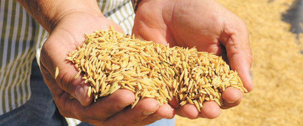

# Projeto de Predição da Cultura de Arroz
Outubro, 2020

* **Projeto para a etapa de seleção para a "*Residência Tecnológica em Ciência de Dados e Analytics para o setor Automotivo*".**
* **Parceria UPE - FCA - Facepe**

* **DESAFIO:** 
    Criar algoritmo que consiga predizer qual a cultura que deve-se plantar, nos próximos anos, para alcançar maior rentabilidade.

